在开发网站时，我们经常会使用第三方平台账号（如 **微信、QQ、Microsoft、Google、Apple** 等）来实现用户登录功能。这类功能通常是通过 **OAuth 2.0 授权协议** 来实现的。

---

## 🔐 OAuth 2.0 标准协议简介

**OAuth 2.0** 是一种授权框架，允许第三方应用在**无需获取用户密码**的情况下，安全地访问用户的受保护资源。

OAuth 2.0 核心定义了以下 **四种授权方式（Grant Types）**，这些方式已在官方标准文档 [RFC 6749](https://datatracker.ietf.org/doc/html/rfc6749) 中明确规定：

| 名称 | Grant Type 参数 | 特点 |
|------|------------------|------|
| **授权码模式** (Authorization Code) | `authorization_code` | 最常用、最安全，适用于 Web 应用和移动 App（✅ **推荐使用**） |
| **简化模式** (Implicit) | `token` | 令牌直接暴露于前端，安全性低，⚠️ **已废弃** |
| **密码模式** (Resource Owner Password Credentials) | `password` | 用户将账号密码直接提供给客户端，⚠️ **仅适用于高度信任场景，不再推荐** |
| **客户端凭据模式** (Client Credentials) | `client_credentials` | 不涉及用户登录，适用于服务与服务之间的接口调用或后台任务 |

📘 想了解更多 OAuth 2.0 协议内容，可参考官方文档：  
👉 [RFC 6749 - The OAuth 2.0 Authorization Framework](https://datatracker.ietf.org/doc/html/rfc6749)

## 🔍 OAuth 2.0 授权码模式工作流程

OAuth 2.0 的授权码模式工作流程如下图所示：

```mermaid
sequenceDiagram
    participant 用户
    participant 客户端应用 as 网页应用
    participant 授权服务器 as 授权服务（如 Microsoft / GitHub / Google）
    participant 资源服务器 as 你的 API 接口

    用户->>客户端应用: 1. 点击登录按钮
    客户端应用->>授权服务器: 2. 向 /authorize 发起授权码请求
    授权服务器->>用户: 3. 跳转到登录/授权页面
    用户->>授权服务器: 4. 输入账号密码并授权
    授权服务器-->>客户端应用: 5. 返回授权码（Authorization Code）
    客户端应用->>授权服务器: 6. 使用授权码 + 客户端凭证换取令牌
    授权服务器->>授权服务器: 7. 验证授权码和客户端凭证
    授权服务器-->>客户端应用: 8. 返回 ID Token 和 Access Token
    客户端应用->>资源服务器: 9. 使用 Access Token 请求用户数据
    资源服务器-->>客户端应用: 10. 返回用户数据响应
```



### 🔁 授权码模式流程（共 10 步）

✅ 1. 用户点击登录链接  
用户在网页应用中点击“使用第三方登录”（如使用 GitHub 登录）。

✅ 2. 应用跳转至授权服务器  
客户端构造授权请求，将用户重定向到授权服务器的 `/authorize` 接口，携带以下参数：
- `client_id`
- `redirect_uri`
- `scope`
- `response_type=code`
- `state`

✅ 3. 授权服务器显示登录/授权页面  
授权服务器展示登录页面及授权确认界面，请求用户登录并同意授权请求。

✅ 4. 用户认证并授权  
用户登录后点击“同意”，授权第三方应用访问其部分资源。

✅ 5. 返回授权码（Authorization Code）  
授权服务器将授权码通过浏览器重定向方式，返回至客户端指定的 `redirect_uri`。

✅ 6. 客户端携带授权码换取令牌  
客户端后端使用授权码向授权服务器的 `/token` 接口发送 POST 请求，包含：

- `code`
- `client_id`
- `client_secret`
- `redirect_uri`
- `grant_type=authorization_code`

✅ 7. 授权服务器验证请求  
授权服务器验证授权码、客户端凭证和回调地址的有效性。

✅ 8. 返回 Access Token 和 ID Token  
验证通过后，返回：
- `access_token`（访问资源所需）
- `id_token`（用于标识用户身份，OpenID Connect 场景中使用）
- `refresh_token`（如启用）

✅ 9. 客户端调用 API 获取用户数据  
客户端携带 `access_token` 调用资源服务器的接口（如 `/api/userinfo`）。

✅ 10. API 返回用户数据  
资源服务器验证 `access_token` 后，返回对应的用户信息或受保护数据。

---

## 🚀 在 ASP.NET Core 中使用 OAuth 登录

在 ASP.NET Core 中，我们通常使用 **授权码模式（Authorization Code）** 来实现第三方登录。

ASP.NET Core 已内置支持以下常用的第三方登录提供商：

- [x] Google（安装 NuGet 包：`Microsoft.AspNetCore.Authentication.Google`）
- [x] Facebook（安装 NuGet 包：`Microsoft.AspNetCore.Authentication.Facebook`）
- [x] Microsoft Account（安装 NuGet 包：`Microsoft.AspNetCore.Authentication.MicrosoftAccount`）
- [x] Twitter（安装 NuGet 包：`Microsoft.AspNetCore.Authentication.Twitter`）

此外，社区维护的 [AspNet.Security.OAuth.Providers](https://github.com/aspnet-contrib/AspNet.Security.OAuth.Providers) 项目还提供了近 **100 多种** 第三方 OAuth 登录认证方式，包括但不限于：

- GitHub
- LinkedIn
- QQ
- WeChat
- Dropbox
- Amazon
- Salesforce 等

🔗 GitHub 地址：  
👉 https://github.com/aspnet-contrib/AspNet.Security.OAuth.Providers

---

## 💻 ASP.NET Core 中使用 OAuth 的示例

### 🔧 配置第三方登录前的准备工作

首先，我们需要在各个第三方平台的开发者中心**注册应用**，并获取对应的 **ClientId** 和 **ClientSecret**。  
（注册流程在此不做详细展开，你可以根据所选平台搜索其开发者文档或注册指南。）

在本示例中，我们以 **Google** 和 **GitHub** 登录为例进行演示：

- **Google 登录**：由 ASP.NET Core 官方提供支持  
- **GitHub 登录**：由社区维护的 [AspNet.Security.OAuth.Providers](https://github.com/aspnet-contrib/AspNet.Security.OAuth.Providers) 提供支持

---

## ✅ 集成 google 登录（示例）

你可以参考以下代码片段，快速集成 Google 登录功能：

```csharp
services.AddAuthentication(options =>
{
    options.DefaultScheme = CookieAuthenticationDefaults.AuthenticationScheme;
    options.DefaultChallengeScheme = GoogleDefaults.AuthenticationScheme;
})
.AddCookie()
.AddGoogle(options =>
{
    options.ClientId = Configuration["Authentication:Google:ClientId"];
    options.ClientSecret = Configuration["Authentication:Google:ClientSecret"];
});


## ✅ 集成 github 登录（示例）

```csharp
services.AddAuthentication(options =>
{
    options.DefaultScheme = CookieAuthenticationDefaults.AuthenticationScheme;
    options.DefaultChallengeScheme = GoogleDefaults.AuthenticationScheme;
})
.AddCookie()
.AddGitHub(options =>
{
    options.ClientId = Configuration["Authentication:GitHub:ClientId"];
    options.ClientSecret = Configuration["Authentication:GitHub:ClientSecret"];
});
```

