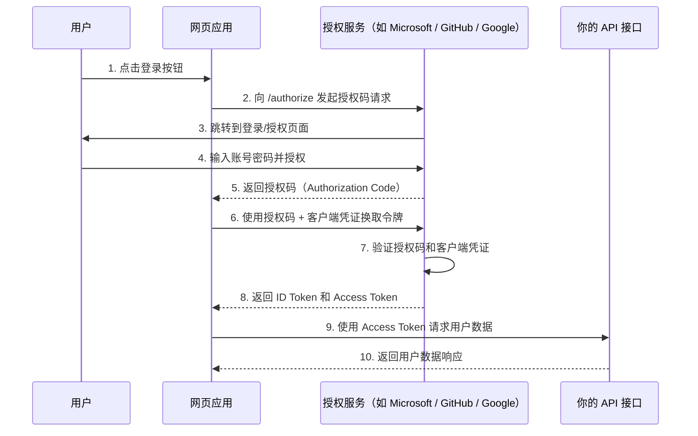

在开发网站时，我们经常会使用第三方平台账号（如 **微信、QQ、Microsoft、Google、Apple** 等）来实现用户登录功能。这类功能通常是通过 **OAuth 2.0 授权协议** 来实现的。

---

## 🔐 OAuth 2.0 标准协议简介

**OAuth 2.0** 是一种授权框架，允许第三方应用在**无需获取用户密码**的情况下，安全地访问用户的受保护资源。

OAuth 2.0 核心定义了以下 **四种授权方式（Grant Types）**，这些方式已在官方标准文档 [RFC 6749](https://datatracker.ietf.org/doc/html/rfc6749) 中明确规定：

| 名称 | Grant Type 参数 | 特点 |
|------|------------------|------|
| **授权码模式** (Authorization Code) | `authorization_code` | 最常用、最安全，适用于 Web 应用和移动 App（✅ **推荐使用**） |
| **简化模式** (Implicit) | `token` | 令牌直接暴露于前端，安全性低，⚠️ **已废弃** |
| **密码模式** (Resource Owner Password Credentials) | `password` | 用户将账号密码直接提供给客户端，⚠️ **仅适用于高度信任场景，不再推荐** |
| **客户端凭据模式** (Client Credentials) | `client_credentials` | 不涉及用户登录，适用于服务与服务之间的接口调用或后台任务 |

📘 想了解更多 OAuth 2.0 协议内容，可参考官方文档：  
👉 [RFC 6749 - The OAuth 2.0 Authorization Framework](https://datatracker.ietf.org/doc/html/rfc6749)

## 🔍 OAuth 2.0 授权码模式工作流程

OAuth 2.0 的授权码模式工作流程如下图所示：



### 🔁 授权码模式流程（共 10 步）

✅ 1. 用户点击登录链接  
用户在网页应用中点击“使用第三方登录”（如使用 GitHub 登录）。

✅ 2. 应用跳转至授权服务器  
客户端构造授权请求，将用户重定向到授权服务器的 `/authorize` 接口，携带以下参数：
- `client_id`
- `redirect_uri`
- `scope`
- `response_type=code`
- `state`

✅ 3. 授权服务器显示登录/授权页面  
授权服务器展示登录页面及授权确认界面，请求用户登录并同意授权请求。

✅ 4. 用户认证并授权  
用户登录后点击“同意”，授权第三方应用访问其部分资源。

✅ 5. 返回授权码（Authorization Code）  
授权服务器将授权码通过浏览器重定向方式，返回至客户端指定的 `redirect_uri`。

✅ 6. 客户端携带授权码换取令牌  
客户端后端使用授权码向授权服务器的 `/token` 接口发送 POST 请求，包含：

- `code`
- `client_id`
- `client_secret`
- `redirect_uri`
- `grant_type=authorization_code`

✅ 7. 授权服务器验证请求  
授权服务器验证授权码、客户端凭证和回调地址的有效性。

✅ 8. 返回 Access Token 和 ID Token  
验证通过后，返回：
- `access_token`（访问资源所需）
- `id_token`（用于标识用户身份，OpenID Connect 场景中使用）
- `refresh_token`（如启用）

✅ 9. 客户端调用 API 获取用户数据  
客户端携带 `access_token` 调用资源服务器的接口（如 `/api/userinfo`）。

✅ 10. API 返回用户数据  
资源服务器验证 `access_token` 后，返回对应的用户信息或受保护数据。

---

## 🚀 在 ASP.NET Core 中使用 OAuth 登录

在 ASP.NET Core 中，我们通常使用 **授权码模式（Authorization Code）** 来实现第三方登录。

ASP.NET Core 已内置支持以下常用的第三方登录提供商：

- Google（安装 NuGet 包：`Microsoft.AspNetCore.Authentication.Google`）
- Facebook（安装 NuGet 包：`Microsoft.AspNetCore.Authentication.Facebook`）
- Microsoft Account（安装 NuGet 包：`Microsoft.AspNetCore.Authentication.MicrosoftAccount`）
- Twitter（安装 NuGet 包：`Microsoft.AspNetCore.Authentication.Twitter`）

此外，社区维护的 [AspNet.Security.OAuth.Providers](https://github.com/aspnet-contrib/AspNet.Security.OAuth.Providers) 项目还提供了近 **100 多种** 第三方 OAuth 登录认证方式，包括但不限于：

- GitHub
- LinkedIn
- QQ
- WeChat
- Dropbox
- Amazon
- Salesforce 等

🔗 GitHub 地址：  
👉 https://github.com/aspnet-contrib/AspNet.Security.OAuth.Providers

---

## 💻 ASP.NET Core 中使用 OAuth 的示例

### 🔧 配置第三方登录前的准备工作

首先，我们需要在各个第三方平台的开发者中心**注册应用**，并获取对应的 **ClientId** 和 **ClientSecret**。  
（注册流程在此不做详细展开，你可以根据所选平台搜索其开发者文档或注册指南。）

在本示例中，我们以 **Google** 和 **GitHub** 登录为例进行演示：

- **Google 登录**：由 ASP.NET Core 官方提供支持  
- **GitHub 登录**：由社区维护的 [AspNet.Security.OAuth.Providers](https://github.com/aspnet-contrib/AspNet.Security.OAuth.Providers) 提供支持

---

## ✅ 集成 google和github 登录（示例）

首先我们需要客户端调用api去发起Challenge，请求第三方授权登录界面。我们会在OnCreatingTicket事件中获取到用户的账号信息。
我们要依赖于接下来就可以根据自己的系统进行业务处理。
在现实真实的环境中我们不但要第三方平台上获取ClientId和 ClientSecret，还要配置回调的url。


```csharp
[Route("api/[controller]")]
[ApiController]
public class AuthController : ControllerBase
{
    /// <summary>
    /// SIGN IN WITH GOOGLE
    /// </summary>
    /// <param name="model"></param>
    /// <returns></returns>
    [HttpGet("google/login")]
    public async Task<IActionResult> SignInWithGoogle()
    {
        return Challenge(GoogleDefaults.AuthenticationScheme);
    }

    [HttpGet("github/login")]
    public IActionResult SigInWithGithub()
    {
        return Challenge(GitHubAuthenticationDefaults.AuthenticationScheme);
    }
}
```

接下来在 `Program.cs` 中配置 Google 和 GitHub 登录：

```csharp
builder.Services.AddAuthentication()
.AddCookie(CookieAuthenticationDefaults.AuthenticationScheme)
.AddGoogle("Google", options =>
{
    options.ClientId = builder.Configuration["Google:ClientId"] ?? throw new ArgumentNullException(nameof(options.ClientId), "GoogleClientId configuration is missing.");
    options.ClientSecret = builder.Configuration["Google:ClientSecret"] ?? throw new ArgumentNullException(nameof(options.ClientSecret), "GoogleClientSecret configuration is missing.");
    options.CallbackPath = $"/api/Auth/google/callback";
    options.SaveTokens = true; // Save tokens
    options.SignInScheme = CookieAuthenticationDefaults.AuthenticationScheme;
    options.Scope.Add("email");
    options.Scope.Add("profile");
    options.Events.OnRedirectToAuthorizationEndpoint = context =>
    {
        // 解码原始 redirect_uri
        var decoded = Uri.UnescapeDataString(context.RedirectUri);
        // 替换掉 http 为 https
        var corrected = decoded.Replace("http://", "https://");
        // 再重新编码
        var encoded = Uri.EscapeDataString(corrected);
        // 重新构造完整 URL（注意不重复编码 querystring）
        var redirectUrl = corrected; // 也可以直接用 corrected
        context.Response.Redirect(redirectUrl);
        return Task.CompletedTask;
    };
    options.Events.OnCreatingTicket = async context =>
    {
        var identity = context.Identity;
        Console.WriteLine("claims: " + string.Join(", ", identity?.Claims.Select(c => $"{c.Type}:{c.Value}")));
        // 这里可以获取到用户的 Google 账号信息
    };
})
.AddGitHub("GitHub", options =>
{
    options.ClientId = builder.Configuration["Github:ClientId"] ?? throw new ArgumentNullException(nameof(options.ClientId), "GitHubClientId configuration is missing.");
    options.ClientSecret = builder.Configuration["Github:ClientSecret"] ?? throw new ArgumentNullException(nameof(options.ClientSecret), "GitHubClientSecret configuration is missing.");
    options.CallbackPath = $"/api/Auth/github/callback";
    options.Scope.Add("user:email");
    options.SaveTokens = true; // Save tokens
    options.SignInScheme = CookieAuthenticationDefaults.AuthenticationScheme;
    options.Events.OnRedirectToAuthorizationEndpoint = context =>
    {
        // 解码原始 redirect_uri
        var decoded = Uri.UnescapeDataString(context.RedirectUri);
        // 替换掉 http 为 https
        var corrected = decoded.Replace("http://", "https://");
        // 再重新编码
        var encoded = Uri.EscapeDataString(corrected);
        // 重新构造完整 URL（注意不重复编码 querystring）
        var redirectUrl = corrected; // 也可以直接用 corrected
        context.Response.Redirect(redirectUrl);
        return Task.CompletedTask;
    };
    options.Events.OnCreatingTicket = async context =>
    {
        var accessToken = context.AccessToken;
        var refreshToken = context.RefreshToken;
        var identity = context.Identity;
        Console.WriteLine("claims: " + string.Join(", ", identity?.Claims.Select(c => $"{c.Type}:{c.Value}")));
        // 这里可以获取到用户的 GitHub 账号信息
    };
});
```

由于我系统中配置了github的登录，下面是我使用github登录之后在OnRedirectToAuthorizationEndpoint事件中打印的用户信息：


## 总结

在 ASP.NET Core 中集成 OAuth 2.0 第三方登录非常简单。通过配置相应的认证服务，我们可以轻松实现 Google、GitHub 等平台的登录功能。这种方式不仅提高了用户体验，还能确保安全性，避免直接处理用户密码。